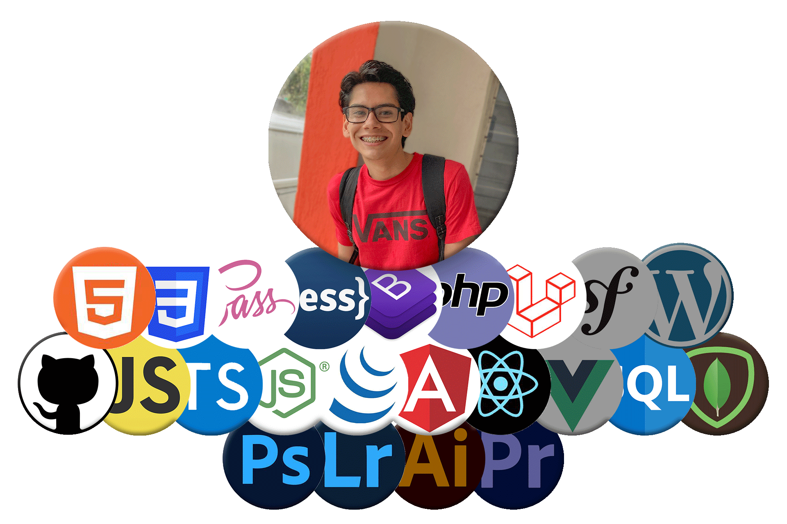
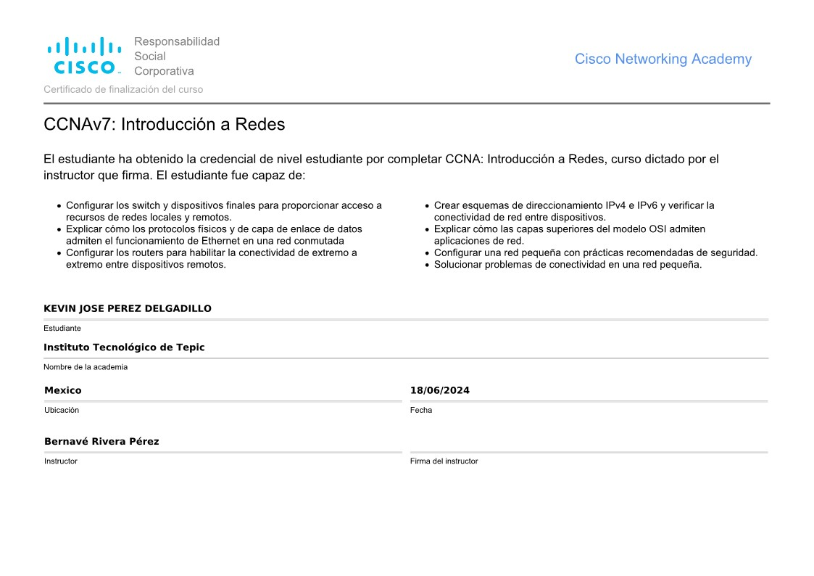
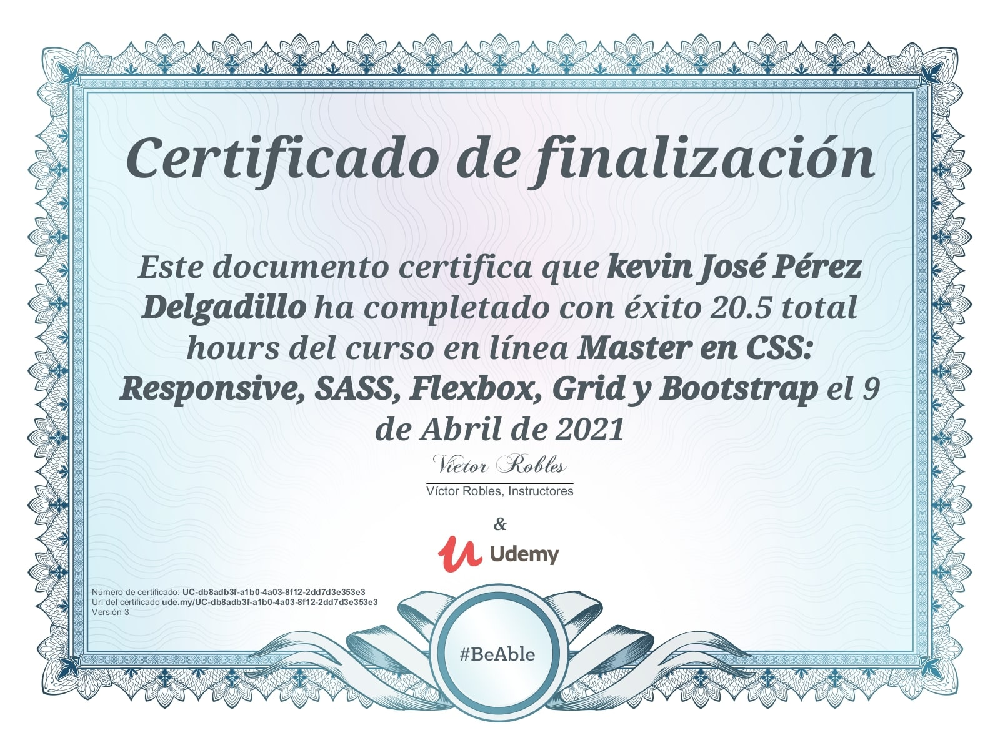
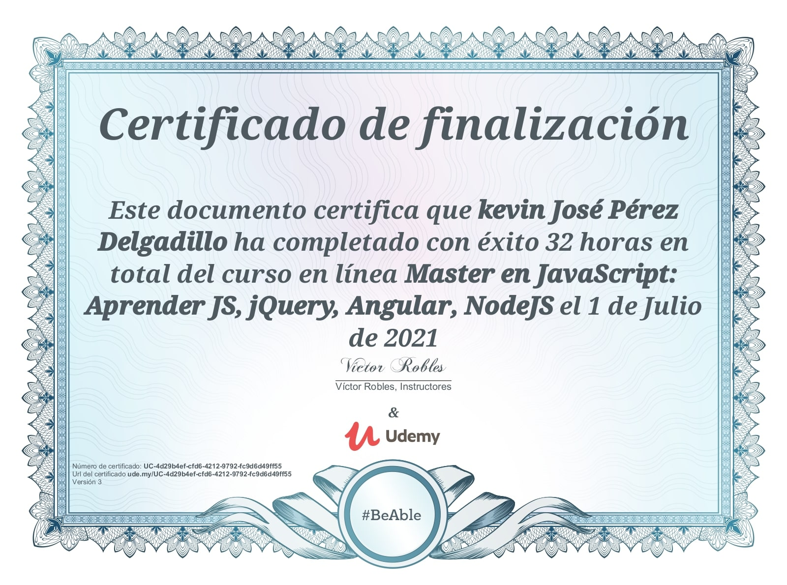
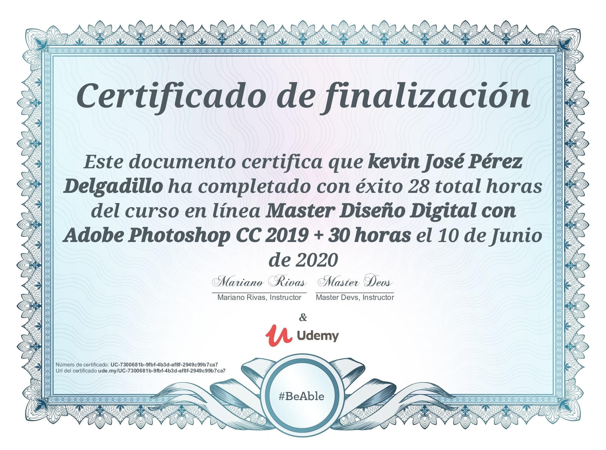

# Kevin José Pérez Delgadillo

# Certificados

## Photoshop
> INTRODUCCION A LAS REDES 2024

## CSS
> HTML, CSS, Flexbox, Grid, Responsive, SASS, LESS, Bootstrap

[URL del certificado](https://www.udemy.com/certificate/UC-db8adb3f-a1b0-4a03-8f12-2dd7d3e353e3/)
## Php
> Php, Laravel, Symfony, Sql, WordPress 

    Proximamente...

## JavaScript
> JavaScript, TypeScript, JQuery, Angular, NodeJS, MongoDB

[URL del certificado](https://www.udemy.com/certificate/UC-4d29b4ef-cfd6-4212-9792-fc9d6d49ff55/)

## Frameworks JavaScript
> Angular, React, Vue.js 

    Proximamente...

## Azure Fundamentals

[URL del certificado](https://portal.certiport.com/Portal/Pages/CredentialVerification.aspx) **Ln9a - sF77**

## Photoshop
> Diseño digial

[URL del certificado]([ude.my/UC-7300681b-9fbf-4b3d-af8f-2949c99b7ca7](https://www.udemy.com/certificate/UC-7300681b-9fbf-4b3d-af8f-2949c99b7ca7/))

## Lightroom
 

[URL del certificado](https://www.udemy.com/certificate/UC-6c4b02d4-4f36-4e59-a63b-d9b211c5dd11/)
